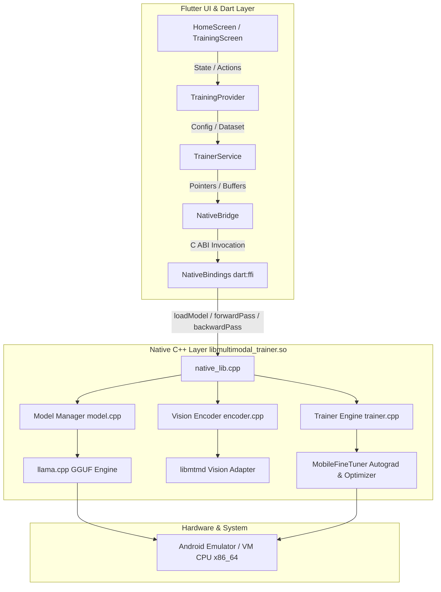
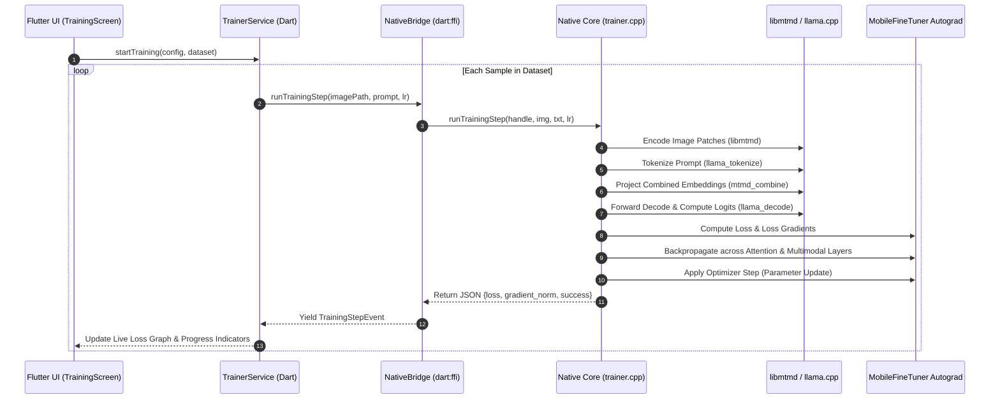

# 🏛️ Architecture & System Design

**MobileFineTuner Multimodal Extension — Qwen3.5-2B (Flutter / C++ FFI)**  
*Duke Kunshan University — Edge Intelligence Lab*

---

## 1. High-Level Architecture Overview

The system bridges a reactive Flutter cross-platform UI with a high-performance native C++ engine via `dart:ffi`.

---

## 2. Multimodal Data & Tensor Flow

---

## 3. Component Details

### 3.1 Flutter UI Layer
- **`TrainingProvider`**: Manages stream subscriptions, `fl_chart` loss history series, accuracy metrics, and step time estimates.
- **`LossGraph`**: GPU-accelerated real-time loss curve rendering with responsive downsampling and tooltips.
- **`LogViewer`**: Terminal log viewer with color tagging.
- **`DatasetScreen`**: In-app dataset preview and sample inspector.

### 3.2 `dart:ffi` Bridge Layer
- Native UTF-8 string allocation with immediate `malloc.free` cleanup to guarantee zero memory leaks.
- Opaque C handle management (`ModelHandle*`) isolating native heap structures from the Dart garbage collector.

### 3.3 C++ Native Core
- **`llama.cpp` Subsystem**: GGUF weight loader, KV-cache manager, context evaluator, and vocabulary mapper.
- **`libmtmd` Subsystem**: Vision transformer patch extractor (spatial token projector for Qwen3.5-VL).
- **`MobileFineTuner` Autograd Subsystem**: Dynamic computation graph evaluator, gradient accumulation buffers, and SGD/Adam optimizer.
- **Checkpoint & Export**: Binary state serialization (`MFTC` magic format) and full GGUF format model exporter.
