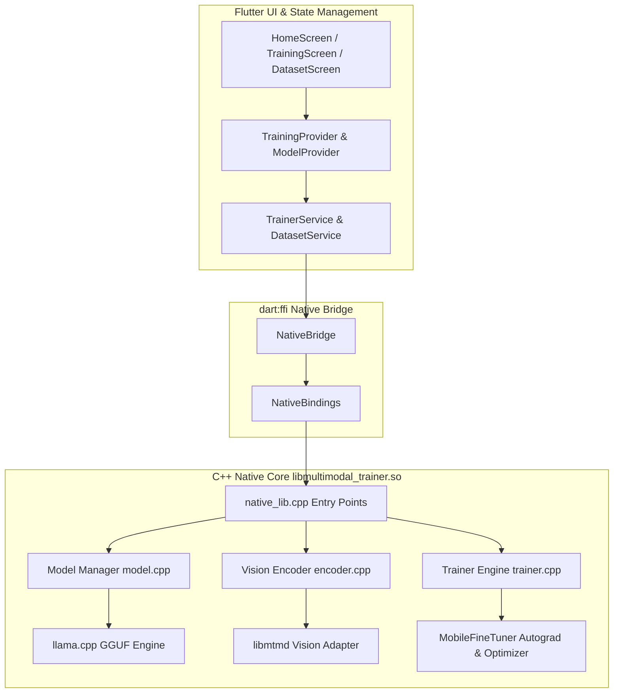

# 🚀 Multimodal Trainer Flutter (Qwen3.5-2B)

**MobileFineTuner Extension for Vision-Language Model (VLM) Fine-Tuning**  
*Duke Kunshan University — Edge Intelligence Lab*

[]()
[]()
[]()

---

## 📌 Project Overview

This project extends **MobileFineTuner** with Vision-Language Model (VLM) fine-tuning capabilities using **Qwen3.5-2B**, integrated via **llama.cpp** and **libmtmd** native libraries over `dart:ffi`.

The primary focus is **correctness** and **end-to-end training pipeline validation** in an **Android Emulator** environment.

---

## 🏛️ System Architecture



---

## 📐 Development Status & Checklist

| Phase | Description | Status |
|---|---|---|
| **Phase 1** | Project Setup & Environment Configuration | ✅ Completed |
| **Phase 2** | Native C++ Library Integration (`llama.cpp`, `libmtmd`, `MobileFineTuner`) | ✅ Completed |
| **Phase 3** | Core Model Implementation & Autograd Backward Propagation | ✅ Completed |
| **Phase 4** | Data Pipeline, Live `fl_chart` Loss Graph, and UI Navigation | ✅ Completed |
| **Phase 5** | End-to-End 100-Step Training Validation, Checkpointing & GGUF Export | ✅ Completed |
| **Phase 6** | Final Polish, Documentation & Verification | ✅ Completed |

---

## 💻 Recommended Android Emulator Configuration

| Setting | Recommended Value |
|---|---|
| **Device Model** | Pixel 4 / Pixel 6 |
| **System Image** | Android 11+ (API Level 30 or higher) |
| **ABI Architecture** | `x86_64` |
| **RAM Allocation** | 8 GB (`8192 MB`) |
| **Internal Storage** | 20 GB |
| **Graphics Acceleration** | Hardware - GLES 2.0 / Automatic |

---

## 🔌 Native C / FFI API Reference

| C Function Signature | Dart Binding | Description |
|---|---|---|
| `void* loadModel(const char* path)` | `loadModel()` | Loads GGUF model and initializes contexts |
| `void unloadModel(void* handle)` | `unloadModel()` | Releases native model and context memory |
| `const char* getModelStatus(void* handle)` | `getModelStatus()` | Returns JSON string with memory and status |
| `void* forwardPass(void* handle, const char* img, const char* txt, int is_training)` | `forwardPass()` | Runs multimodal forward pass |
| `int backwardPass(void* handle, void* fwd_result)` | `backwardPass()` | Computes gradients and updates parameters |
| `const char* runTrainingStep(void* handle, const char* img, const char* txt, float lr)` | `runTrainingStep()` | Runs complete forward+backward training step |
| `int saveCheckpoint(void* handle, const char* path, int epoch, int step)` | `saveCheckpoint()` | Serializes training checkpoint to disk |
| `int loadCheckpoint(void* handle, const char* path)` | `loadCheckpoint()` | Restores training state from checkpoint file |
| `int exportModelGGUF(void* handle, const char* path)` | `exportModelGGUF()` | Exports trained weights to GGUF format |

---

## 🛠️ Build & Run Guide

### 1. Install Dependencies
```bash
flutter pub get
```

### 2. Run Static Analysis
```bash
flutter analyze
```

### 3. Run Automated Test Suites
```bash
flutter test
```

### 4. Launch Application on Android Emulator
```bash
flutter run
```

---

## 🔧 Troubleshooting Guide

### 1. Model Fails to Load in Emulator
- **Check Memory Allocation**: Ensure your Android Virtual Device (AVD) is configured with at least **8GB RAM**.
- **Path Verification**: Confirm the GGUF model path exists in `assets/models/` or the device local storage.

### 2. High CPU / Slow Step Execution
- **CPU Threads**: By default, `llama.cpp` uses 4 threads. Adjust `n_threads` in `llama_context_params` if CPU contention occurs on host.
- **Hardware Acceleration**: Enable Hardware Graphics acceleration in AVD settings (`GLES 2.0`).

### 3. Native Symbol Not Found
- Rebuild CMake by executing `flutter clean && flutter pub get` to ensure `libmultimodal_trainer.so` is bundled into the APK.

---

## 👥 Authors & Acknowledgments
- **Developer**: Muhammad Assad Ullah (*Undergraduate Collaborator*)
- **Advisor**: Jiaxiang Geng (*Ph.D. Researcher, Duke Kunshan University*)
- **Principal Investigator**: Prof. Bing Luo, Ph.D. (*Director, Edge Intelligence Lab*)
