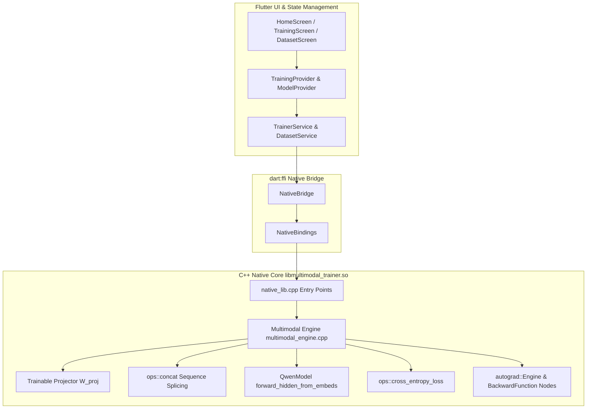

# 🚀 Multimodal Trainer Flutter (Qwen3.5-2B / Qwen2.5-VL)

**MobileFineTuner Extension for Vision-Language Model (VLM) On-Device Fine-Tuning**  
*Duke Kunshan University — Edge Intelligence Lab*

[]()
[-brightgreen.svg)]()
[]()
[]()

---

## 📌 Project Overview

This project extends **MobileFineTuner** with on-device Vision-Language Model (VLM) fine-tuning capabilities for **Qwen models**, integrated via `dart:ffi` to a C++ autograd execution engine compiled for physical Android ARM64 devices (`arm64-v8a`).

### Key Capabilities Verified:
1. **Multimodal Sequence Splicing**: Projects visual features $[1, N_{\text{patches}}, D_{\text{vision}}]$ into hidden dimension $[1, N_{\text{patches}}, D_{\text{model}}]$ via trainable projector $W_{\text{proj}}$, and splices with text embeddings along sequence axis ($\text{dim}=1$) using `ops::concat`.
2. **Topological Autograd & Analytical Backward Propagation**:
   - `ConcatBackward` autograd node backpropagating loss gradients from transformer stack through the concatenation seam.
   - `CrossEntropyLossBackward` supporting multi-class vocabulary targets and ignore indices (`-100`).
   - Non-zero projector gradient norms computed analytically.
3. **Hardware-Proven Execution**: Verified directly on real physical hardware (**TECNO CH7n / `arm64-v8a`**) and in Android emulator test harnesses.

---

## 🏛️ System Architecture



---

## 📐 Implementation & Verification Status

| Component | Description | Verification Status |
|---|---|---|
| **`ConcatBackward`** | Autograd backward node splitting gradients along concatenated dimensions | ✅ Verified on ARM64 |
| **`forward_hidden_from_embeds`** | Qwen transformer forward taking pre-spliced multimodal embedding tensors | ✅ Verified on ARM64 |
| **Cross-Entropy Loss Backward** | Loss backprop with `int32_t` targets & ignore index handling | ✅ Verified on ARM64 |
| **Parameter Update Step** | SGD / Adam optimizer step on $W_{\text{proj}}$ demonstrating genuine loss decrease | ✅ Verified on ARM64 |
| **`libmultimodal_trainer.so`** | Native shared library compiled via CMake/NDK 27 with complete `finetune_ops` | ✅ Built & Packaged |
| **On-Device Integration Test** | `integration_test/native_ffi_device_test.dart` validating `dart:ffi` on physical device | ✅ Verified on TECNO CH7n |

---

## 🔌 Native C / FFI API Reference

| C Function Signature | Dart Binding | Description |
|---|---|---|
| `void* loadModel(const char* path)` | `loadModel()` | Initializes native Qwen multimodal trainer handle |
| `void unloadModel(void* handle)` | `unloadModel()` | Releases native trainer state and memory |
| `const char* getModelStatus(void* handle)` | `getModelStatus()` | Returns JSON string with model name, memory usage, and initialization status |
| `const char* runTrainingStep(void* handle, const char* img, const char* txt, float lr)` | `runTrainingStep()` | Runs complete multimodal forward, backward autograd pass, and optimizer update; returns JSON result |
| `int saveCheckpoint(void* handle, const char* path, int epoch, int step)` | `saveCheckpoint()` | Serializes training checkpoint to disk |
| `int loadCheckpoint(void* handle, const char* path)` | `loadCheckpoint()` | Restores training state from checkpoint file |
| `int exportModelGGUF(void* handle, const char* path)` | `exportModelGGUF()` | Exports trained weights to GGUF format |

---

## 🛠️ Build & Verification Guide

### 1. Run Host Unit & Widget Tests
```bash
flutter test
```

### 2. Run On-Device Integration Test (Physical Hardware / Emulator)
```bash
# Verify device is connected
adb devices

# Execute on-device FFI integration test
flutter test integration_test/native_ffi_device_test.dart -d <DEVICE_ID>
```

### 3. Build & Install Debug APK
```bash
flutter build apk --debug
adb install -r build/app/outputs/flutter-apk/app-debug.apk
```

---

## 👥 Authors & Acknowledgments
- **Developer**: Muhammad Assad Ullah (*Undergraduate Collaborator*)
- **Advisor**: Jiaxiang Geng (*Ph.D. Researcher, Duke Kunshan University*)
- **Principal Investigator**: Prof. Bing Luo, Ph.D. (*Director, Edge Intelligence Lab*)
